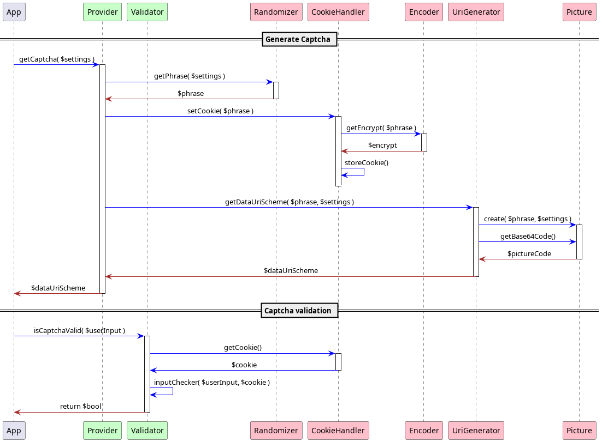

# Refactoring

* * *

[1. New Structure](#1-new-structure)
[2. Sequence diagram](#2-sequence-diagram)

* * *

## 1. New structure

```bash
# in application src/Service folder

PhilAll-SimpleCaptcha
 ├─Font
 │  └─MAROLA__.TTF  # credits to Nú-Dës designer, see http://www.nudes.com.br/
 ├─DataProvider
 │  ├─Randomizer.php
 │  └─UriGenerator.php
 ├─DataTransformer
 │  ├─Picture.php
 │  └─Encoder.php
 ├─DataStorage
 │  └─CookieHandler.php
 ├─Provider.php
 └─Validator.php
```

### Provider

Provide captcha embedded picture URI data scheme.
Set a captcha cookie.

### Validator

Checks user input validity.

### Randomizer

Generate a random phrase.

### UriGenerator

Provide an embedded picture URI data scheme.

### Picture

Generate image.
Supply base 64 image code.

### CookieHandler

Set captcha cookie from generated phrase.
Get captcha cookie.

### Encoder

Used by CokkieHandler and Picture.

* * *

## 2. Sequence Diagram


